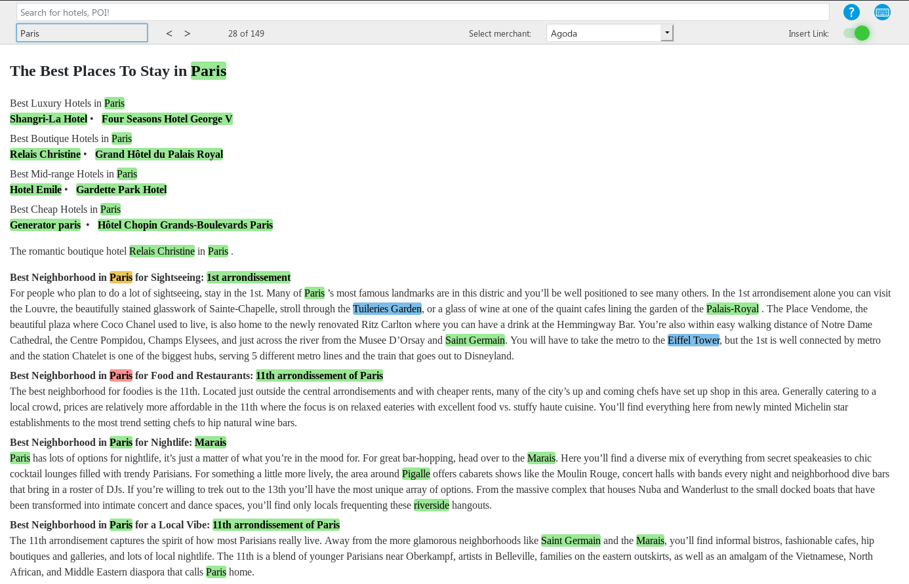

#  Travel Ads Network
Install Traveladsnetwork WordPress Plugin and start monetizing your content by adding over 50 different merchants from hotels, flights, tour & activities and more…

## Description

__Install Traveladsnetwork WordPress Plugin and start monetizing your content by adding over 50 different merchants from hotels, flights, tour & activities and more…__

Our easy-to-integrate widget is a simple solutions for destination websites, blogs, travel communities, and tourism boards.

__Note:__ We are not pushing any advertising.

### What does the “Travel Ads Network” plugin offers:

__For your website visitors:__ helping your website visitors to find the best hotel, flight and activity offers according to their travel needs, while generating steady income.

Some of our merchants include: Agoda, Expedia, Booking.com, Klook,... 

__For you:__ a new source of income and added value to your website readers.

### How does it work?

1. Create your account Search for: Traveladsnetwork or click on this link: [https://wordpress.org/plugins/search/Traveladsnetwork]
1. Install and activate the plugin.
1. Access the admin panel to select which merchants you want to display, specify the maximum number of links per page and select in which mode you prefer to work: automatic (we do the job for you) / manual (you select which merchant to attach to a keyword one by one).

Start monetizing your content with relevant travel related merchants, let your audience grab the best deals, while getting the highest commission in the market.

Your earnings will be displayed in your Travel Ads Network Dashboard. We make scheduled, automated, monthly payouts.

What potential features will this plugin have?

We are considering building this additional features in a later phase:
- Search Forms
- Hotel Widget

We value your comments and feedbacks.

Languages supported:
- English

## Installation
1. Upload the plugin to the `/wp-content/plugins/` directory
2. Activate the plugin through the \'Plugins\' menu in WordPress
3. __(Optionnal)__ configure the plugin in the TravelAds menu, in your wordpress site
4. Let the plugin do its work!

## Frequently Asked Questions
If any issues, please send an email to wp_plugin@traveladsnetwork.com

## Screenshots

---

---

---

## Changelog
= 1.0 =
- First version!

## Upgrade Notice
No upgrade available for now

## Credits

Contributors: christophesecher  
Tags: travel, affiliate plugin, affiliate link, deeplinking, deeplinks, travel booking, bloggers, merchant, travel content, travel, Travel Ads Network, Traveladsnetwork, content monetization, creating purchase intent, monetize your audience data, Convert Content into Revenue  
Tags: travel affiliate plugin affiliate link deeplinking deeplinks travel booking bloggers merchant travel content travel Travel Ads Network Traveladsnetwork content monetization creating purchase intent monetize your audience data Convert Content into Revenue  
Requires at least: 4.9.0  
Tested up to: 4.9.8  
Requires PHP: 7.3  
Stable tag: trunk  
License: GPLv2 or later  
License URI: http://www.gnu.org/licenses/gpl-2.0.html  
